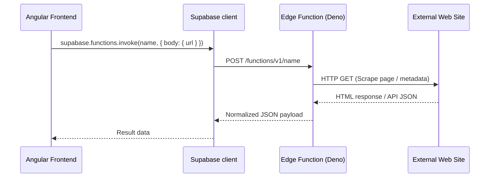

# Supabase Edge Functions Integration Guide

This document describes how Supabase Edge Functions are utilized in **A Bookshelf** to power automated metadata extraction and release tracking.

The application invokes two Edge Functions hosted on Supabase:
1. **`fetch-metadata`**: Used for extracting a rich overview of a book (title, cover, genres, language, chapters) to pre-fill creation and edit forms.
2. **`fetch-latest`**: Used for background updates and manual scraping of the latest chapter releases on books.

---

## 1. Architecture Overview
Supabase Edge Functions are serverless TypeScript functions running on Deno. They allow the frontend to safely run scraping logic and bypass CORS restrictions when making requests to external web sites.

The frontend communicates with these functions using the official Supabase Client (`@supabase/supabase-js`), which is injected as `SUPABASE_CLIENT` in Angular.



---

## 2. Function `fetch-metadata`
Extracts comprehensive book details from a single source link.

### Invocation Scenarios
* **Smart Add Screen (`/add`):** Found in [add-book-page.component.ts](file:///c:/Users/aneno/OneDrive/Personal/Creativity/Hjemmesider/a-bookshelf/angular/src/app/features/add-book/add-book-page.component.ts). Users paste a link into [MetadataFetcherComponent](file:///c:/Users/aneno/OneDrive/Personal/Creativity/Hjemmesider/a-bookshelf/angular/src/app/shared/components/metadata-fetcher/metadata-fetcher.component.ts) and click **Fetch**.
* **Edit Book Dialog:** Found in [book-details-page.component.ts](file:///c:/Users/aneno/OneDrive/Personal/Creativity/Hjemmesider/a-bookshelf/angular/src/app/features/book-details/book-details-page.component.ts). Allows overlaying metadata updates onto an existing form.

### Invocation Signature
```typescript
const { data, error } = await this.supabase.functions.invoke('fetch-metadata', {
  body: { url: sourceUrl },
});
```

### Returned Payload Structure (`MetadataPayload`)
The function returns a JSON object representing the crawled book data:
```typescript
export interface MetadataPayload {
  title?: string | null;
  description?: string | null;
  image?: string | null;            // Maps to coverUrl
  genres?: string[] | null;
  language?: string | null;
  original_language?: string | null; // Maps to originalLanguage
  latest_chapter?: string | null;    // Maps to latestChapter
  chapter_count?: number | null;     // Maps to chapterCount
  last_uploaded_at?: string | null;  // ISO Datetime string
}
```

### Frontend Processing
1. The response is handled by `applyMetadataPayload()` in `MetadataFetcherComponent`.
2. Values are mapped to frontend naming conventions using `buildMetadataPatch(metadata)`.
3. If `autoAddSource` is enabled (default on Smart Add), the fetched URL is automatically synced and pushed into the form's `sources` list.
4. The patched values are overlaid on the Angular `FormGroup`.

---

## 3. Function `fetch-latest`
Queries a primary source URL to check for newly published chapters.

### Invocation Scenarios
* **Batch Update Check (Bookshelf Page):** Triggers from [bookshelf-page.component.ts](file:///c:/Users/aneno/OneDrive/Personal/Creativity/Hjemmesider/a-bookshelf/angular/src/app/features/bookshelf/bookshelf-page.component.ts) when navigating to the "Waiting" shelf and clicking **Check Updates**. The app runs updates sequentially or concurrently across all waiting books with a valid source.
* **Single Book Refresh (Book Details Page):** Triggers in [book-details-page.component.ts](file:///c:/Users/aneno/OneDrive/Personal/Creativity/Hjemmesider/a-bookshelf/angular/src/app/features/book-details/book-details-page.component.ts) when clicking the **Fetch Latest Chapter** button in read-only mode.

### Invocation Signature
```typescript
const { data, error } = await supabase.functions.invoke('fetch-latest', {
  body: { url: sourceUrl },
});
```

### Returned Payload Structure
A lightweight release payload containing only update indicators:
```typescript
export interface FetchLatestResponse {
  latest_chapter?: string | null;
  chapter_count?: number | null;
  last_uploaded_at?: string | null; // ISO Date string
}
```

### Frontend Processing
1. When the results are returned, they are verified in `BookService.buildLatestUpdatePayload(book, data)`.
2. The service compares the new values against the book's current local state:
   * Has `latest_chapter` changed?
   * Is `chapter_count` higher?
   * Is `last_uploaded_at` newer?
3. If updates are found, it generates a database payload and applies the update via `BookRepository.update()`.
4. State is updated reactively, updating the UI.

---

## 4. Error Handling
Both function integrations catch network and application-level errors:
* Check for transport errors in `error` from `supabase.functions.invoke`.
* Check for application errors returned inside the function body (e.g. `{ success: false, error: "Scraping timed out" }`).
* Display human-friendly error messages on banner components (like `staleMessage` or `waitingUpdateError`).
